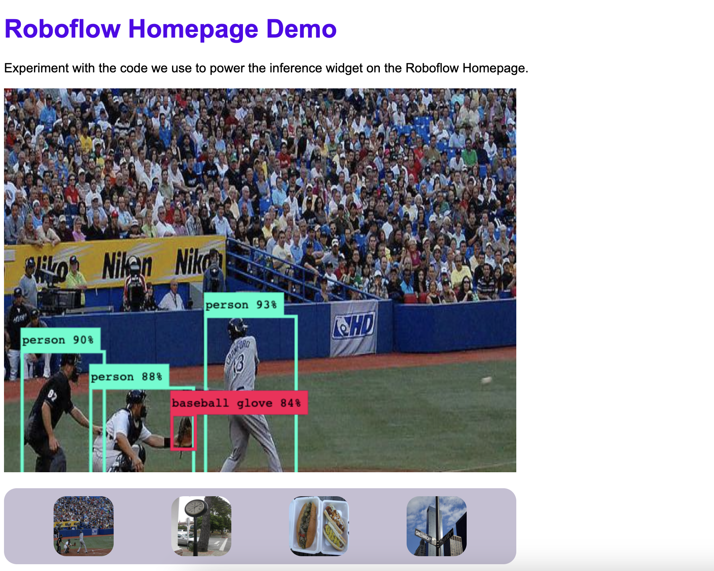
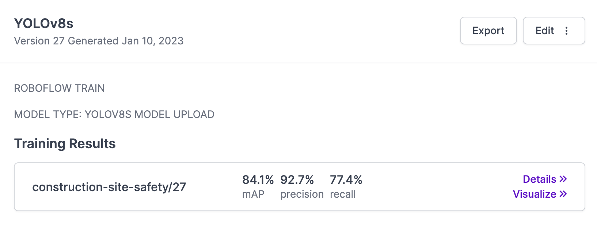

  

      
      
      
      
      
      
      
      
      <a href="https://disuss.roboflow.com">
          
      
      
      </a>
  

# Roboflow Homepage Demo

This repository contains the code used to power the inference widget on the [Roboflow](https://roboflow.com) homepage, with some changes to make it more generic.

The web page in this repository supports running a model hosted on Roboflow by:

1. Using your webcam to run inference.
2. Selecting from a predefined image to run inference.
3. Uploading an image to run inference.

## Project Screenshot

## Use This Project

This repository is a template, which means you can directly copy this code into your own repository from GitHub.

Click "Use this template" on GitHub to create a copy of this repository with which you can experiment.

You can also test a live [Repl.it of this project](https://repl.it/@roboflow/roboflow-homepage-demo) and fork the Repl.it to your own account to build on top of it.

## Getting Started

Once you clone this repository into your own environment, you'll need to add your Roboflow API key to the `script.js` file. Search for the term "API_KEY" and replace the empty string with your API key. For steps on how to find your API key, see the [Roboflow documentation](https://docs.roboflow.com/inference/web-browser).

By default, this project runs a model called `microsoft-coco` that was trained using the Microsoft COCO dateset. You can change the model that is used by changing the `model_name` variable in the `script.js` file and the `version` version number variable.

To find your model name and version number, go to the Deploy tab associated with your model in Roboflow. The model name is the string that appears under the "Training Results" section of the application. The version number is the number that appears next to the string.

### Deploy to GitHub Pages

You can deploy this project to GitHub pages to host your project online.

To do so:

1. Click "Use this template" and follow the instructions to create a copy of this repository in your own GitHub account.
2. Go to the Settings tab of your repository.
3. Click "Pages" in the sidebar.
4. Select "main" as the branch from which to deploy.
5. Click "Save".

Your project will now be hosted at `https://<your-github-username>.github.io/<your-repository-name>/index.html`.

## Technology Stack

- JavaScript
- [roboflow.js](https://docs.roboflow.com/inference/web-browser)

## Contributing

Do you have an idea on how we can improve this project? Feel free to file an Issue so we can discuss your ideas. If you 
have identified a bug, please file an issue. PRs that solve any bugs you encounter are greatly appreciated!
